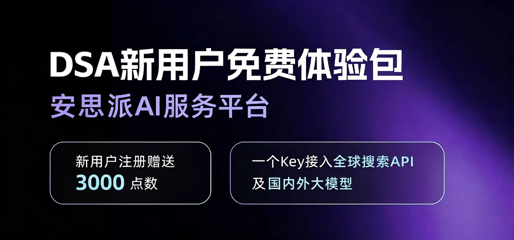

<div align="center">

# 📈 Stock Intelligent Analysis System

[](https://github.com/ZhuLinsen/daily_stock_analysis/stargazers)
[](https://github.com/ZhuLinsen/daily_stock_analysis/actions/workflows/ci.yml)
[](https://opensource.org/licenses/MIT)
[](https://www.python.org/downloads/)
[](https://github.com/features/actions)
[](https://hub.docker.com/r/zhulinsen/daily_stock_analysis)

<p align="center">
  &nbsp;<a href="https://hellogithub.com/repository/ZhuLinsen/daily_stock_analysis" target="_blank"></a>
</p>

> 🤖 AI-powered intelligent analysis system for A-share / Hong Kong / US / Japan / Korea / Taiwan stocks with watchlist support. Automatically analyzes daily and pushes "Decision Dashboard" to WeCom (Enterprise WeChat) / Feishu / Telegram / Discord / Slack / Email

[**Product Preview**](#-product-preview) · [**Features**](#-features) · [**Quick Start**](#-quick-start) · [**Push Effects**](#-push-effects) · [**Documentation Center**](docs/INDEX.md) · [**Full Guide**](docs/full-guide.md)

Simplified Chinese | [English](docs/README_EN.md) | [Traditional Chinese](docs/README_CHT.md)

</div>

## 💖 Sponsors
<div align="center">
  <p align="center">
    <a href="https://open.anspire.cn/dsa?share_code=QFBC0FYC" target="_blank"></a>
    <a href="https://serpapi.com/baidu-search-api?utm_source=github_daily_stock_analysis" target="_blank"></a>
  </p>
</div>


## 🖥️ Product Preview

<p align="center">
  
</p>

## ✨ Features

| Capability | Coverage |
|------|------|
| AI Decision Report | Core conclusions, score, trends, buy/sell signals, risk alerts, catalysts, action checklist |
| Multi-market Data Aggregation | Covers A-share, Hong Kong, US, Japan, Korea, Taiwan stocks and ETFs; supports market data, candlestick charts, technical indicators, news, announcements, fundamentals and report auxiliary data; see [Market Support Boundaries](docs/market-support.md) for data source capabilities and limits across markets |
| Web / Desktop Workspace | Manual analysis, task progress, historical reports, full Markdown, backtest, portfolio, configuration management, light / dark themes |
| Agent Strategy Q&A | Multi-turn follow-up questions, supports 15 built-in strategies including MA crossover, Chan theory, wave theory, trend, hot topics, events, growth, expectations; covers Web/Bot/API |
| Smart Import & Completion | Image, CSV/Excel, clipboard import; stock code/name/pinyin/alias completion |
| Automation & Push Notifications | GitHub Actions, Docker, local scheduled tasks, FastAPI service, and WeCom (Enterprise WeChat) / Feishu / Telegram / Discord / Slack / Email push notifications |

> For feature details, field contracts, fundamentals P0 timeout semantics, trading discipline, data source priority, and Web/API behavior, see [Full Configuration & Deployment Guide](docs/full-guide.md).

### Tech Stack & Data Sources

| Type | Supported |
|------|------|
| AI Models | [Anspire](https://open.anspire.cn/dsa?share_code=QFBC0FYC), [AIHubMix](https://aihubmix.com/?aff=CfMq), Gemini, OpenAI-compatible, DeepSeek, Tongyi Qianwen, Claude, Ollama local models, etc. |
| Market Data | [TickFlow](https://tickflow.org/auth/register?ref=WDSGSPS5XC), AkShare, Tushare, Pytdx, Baostock, YFinance, Longbridge |
| News Search | [Anspire](https://open.anspire.cn/dsa/?share_code=QFBC0FYC), [SerpAPI](https://serpapi.com/baidu-search-api?utm_source=github_daily_stock_analysis), [Tavily](https://tavily.com/), [Bocha](https://open.bocha.cn/), [Brave](https://brave.com/search/api/), [MiniMax](https://platform.minimaxi.com/), SearXNG |
| Social Sentiment | [Stock Sentiment API](https://api.adanos.org/docs) (Reddit / X / Polymarket, US stocks only, optional) |

> The project includes AkShare, Baostock, YFinance and other free market data sources by default, requiring zero configuration. Free sources may be affected by upstream rate limits, API changes, and network fluctuations, so stability is not guaranteed. For long-term scheduled tasks, batch analysis, or more stable market data, consider configuring token-based data sources such as TickFlow, Tushare, or Longbridge. See [Data Source Configuration](docs/full-guide.md#data-source-configuration) for applicable markets, Actions mapping, and fallback rules.

## 🚀 Quick Start

### Method 1: [GitHub Actions (Recommended)](https://www.bilibili.com/video/BV11FEb66EXG/)

> Complete deployment in 5 minutes, zero cost, no server required.


#### 1. Fork This Repository

Click the `Fork` button in the top right corner (and give it a Star⭐ to show support)

#### 2. Configure Secrets

`Settings` → `Secrets and variables` → `Actions` → `New repository secret`

**AI Model Configuration (configure at least one)**

Select one model provider and fill in the API Key; for multi-model, image recognition, local models, or advanced routing, refer to [LLM Configuration Guide](docs/LLM_CONFIG_GUIDE.md).

| Secret Name | Description | Required |
|------------|------|:----:|
| `ANSPIRE_API_KEYS` | [Anspire](https://open.anspire.cn/dsa?share_code=QFBC0FYC) API Key，一Key同时启用全球热门大模型和联网搜索，本项目新用户提供30元等额的免费额度（GLM5.2、GPT等模型特惠中） | **推荐** |
| `AIHUBMIX_KEY` | [AIHubMix](https://aihubmix.com/?aff=CfMq) API Key，一Key切换使用全系模型，无需科学上网，本项目可享 10% 优惠 | **推荐** |
| `GEMINI_API_KEY` | Google Gemini API Key | 可选 |
| `ANTHROPIC_API_KEY` | Anthropic Claude API Key | 可选 |
| `OPENAI_API_KEY` | OpenAI 兼容 API Key（支持 DeepSeek、通义千问等） | 可选 |
| `OPENAI_BASE_URL` / `OPENAI_MODEL` | 使用 OpenAI 兼容服务时填写 | 可选 |

> Ollama is more suitable for local / Docker deployment. GitHub Actions recommends using cloud APIs.

**Notification Channel Configuration (configure at least one)**

| Secret Name | Description |
|------------|------|
| `WECHAT_WEBHOOK_URL` | WeCom (Enterprise WeChat) Bot |
| `FEISHU_WEBHOOK_URL` | Feishu Bot |
| `TELEGRAM_BOT_TOKEN` + `TELEGRAM_CHAT_ID` | Telegram |
| `DISCORD_WEBHOOK_URL` | Discord Webhook |
| `SLACK_BOT_TOKEN` + `SLACK_CHANNEL_ID` | Slack Bot |
| `EMAIL_SENDER` + `EMAIL_PASSWORD` | Email Push |

For more channels, signature verification, group emails, Markdown-to-image conversion and other configurations, see [Notification Channel Detailed Configuration](docs/full-guide.md#notification-channel-detailed-configuration).

**Watchlist Configuration (Required)**

| Secret Name | Description | Required |
|------------|------|:----:|
| `STOCK_LIST` | Watchlist stock codes, e.g. `600519,hk00700,AAPL,7203.T,005930.KS,2330.TW` | ✅ |

**News Source Configuration (Recommended)**

News sources significantly impact the quality of sentiment, announcements, events, and catalysts. It is recommended to configure at least one search service.

| Secret Name | Description | Required |
|------------|------|:----:|
| `ANSPIRE_API_KEYS` | [Anspire AI Search](https://open.anspire.cn/dsa?share_code=QFBC0FYC)：汇聚全球舆情信息，适配A股、美股、港股等新闻和舆情检索；同一Key可复用大模型服务，本项目新用户提供免费30元等额的免费点数 | **推荐** |
| `SERPAPI_API_KEYS` | [SerpAPI](https://serpapi.com/baidu-search-api?utm_source=github_daily_stock_analysis)：搜索引擎结果补强，适合实时金融新闻 | **推荐** |
| `TAVILY_API_KEYS` | [Tavily](https://tavily.com/)：通用新闻搜索 API | 可选 |
| `BOCHA_API_KEYS` | [博查搜索](https://open.bocha.cn/)：中文搜索优化，支持 AI 摘要 | 可选 |
| `BRAVE_API_KEYS` | [Brave Search](https://brave.com/search/api/)：隐私优先，美股资讯补强 | 可选 |
| `MINIMAX_API_KEYS` | [MiniMax](https://platform.minimaxi.com/)：结构化搜索结果 | 可选 |
| `SEARXNG_BASE_URLS` | [SearXNG 自建实例](https://searx.space/)：无配额兜底，适合私有部署 | 可选 |

For more search sources, social sentiment, and fallback rules, see [Search Service Configuration](docs/full-guide.md#search-service-configuration).

**Market Data Source Configuration (Optional)**

> By default, free data sources such as AkShare, Baostock, and YFinance are used. The "not configured" message in logs does not affect operation.
> For more stable market data, configure the following Secrets by market:

| Secret Name | Applicable Market | Description |
|------------|:--------:|------|
| `TUSHARE_TOKEN` | A-share | Improves historical market data stability |
| `LONGBRIDGE_OAUTH_CLIENT_ID` + `LONGBRIDGE_OAUTH_TOKEN_CACHE_B64` | Hong Kong / US Stocks | Fills in volume ratio, turnover rate, PE and other fields |

> See [Data Source Configuration](docs/full-guide.md#data-source-configuration) for details.

#### 3. Enable Actions

`Actions` tab → `I understand my workflows, go ahead and enable them`

#### 4. Manual Test

`Actions` → `Daily Stock Analysis` → `Run workflow` → `Run workflow`

#### Done

By default, it runs automatically every **weekdays at 18:00 (Beijing time)**. It can also be triggered manually. It does not run on non-trading days (including A/H/US holidays) by default; see [Full Guide](docs/full-guide.md#scheduled-task-configuration) for rules on force run, trading day validation, and checkpoint resume.

### Method 2: [Client Configuration Tutorial](https://www.bilibili.com/video/BV11FEb66Eyr/) / Local Run / Docker Deployment

```bash
# Clone the project
git clone https://github.com/ZhuLinsen/daily_stock_analysis.git && cd daily_stock_analysis

# Install dependencies
pip install -r requirements.txt

# Configure environment variables
cp .env.example .env && vim .env

# Run analysis
python main.py
```

Common commands:

```bash
python main.py --debug
python main.py --dry-run
python main.py --stocks 600519,hk00700,AAPL,2330.TW
python main.py --market-review
python main.py --schedule
python main.py --serve-only
```

> For Docker deployment, scheduled tasks, and cloud server access, refer to [Full Guide](docs/full-guide.md); for desktop client packaging, refer to [Desktop Packaging Guide](docs/desktop-package.md).

## 📱 Push Effects

### Decision Dashboard
```
🎯 2026-02-08 Decision Dashboard
Analyzed 3 stocks | 🟢Buy:0 🟡Hold:2 🔴Sell:1

📊 Analysis Summary
⚪ Zhongtungao (000657): Hold | Score 65 | Bullish
⚪ Yongding (600105): Hold | Score 48 | Sideways
🟡 Xinlaiying (300260): Sell | Score 35 | Bearish

⚪ Zhongtungao (000657)
📰 Key Information Overview
💭 Sentiment: Market focus on its AI attributes and high earnings growth, sentiment leans positive, but needs to absorb short-term profit-taking and institutional outflow pressure.
📊 Earnings Expectations: Based on sentiment data, company's first three quarters of 2025 showed strong year-over-year earnings growth, solid fundamentals supporting stock price.

🚨 Risk Alerts:

Risk 1: Major institutional net sell-off of 363 million CNY on Feb 5, watch for short-term selling pressure.
Risk 2: Chip concentration at 35.15%, indicating dispersed chips, potential resistance to price increases.
Risk 3: Sentiment mentions historical compliance violations and restructuring risk warnings, need to stay vigilant.
✨ Positive Catalysts:

Catalyst 1: Company positioned as core AI server HDI supplier, benefiting from AI industry development.
Catalyst 2: Non-recurring net profit surged 407.52% year-over-year in first three quarters of 2025, strong earnings performance.
📢 Latest Update: [Latest News] Sentiment indicates company is a leader in AI PCB micro-drill segment, deeply connected to global top PCB/substrate manufacturers. Major institutional net sell-off of 363 million CNY on Feb 5, need to monitor subsequent capital flows.

---
Generated at: 18:00
```

### Market Review
```
🎯 2026-01-10 Market Review

📊 Major Indices
- Shanghai Composite: 3250.12 (🟢+0.85%)
- Shenzhen Component: 10521.36 (🟢+1.02%)
- ChiNext: 2156.78 (🟢+1.35%)

📈 Market Overview
Gains: 3920 | Declines: 1349 | Limit Up: 155 | Limit Down: 3

🔥 Sector Performance
Leading: Internet Services, Cultural Media, Minor Metals
Lagging: Insurance, Aviation & Airports, Photovoltaic Equipment
```

## ⚙️ Configuration

For complete environment variables, model channels, notification channels, data source priority, trading discipline, fundamentals P0 semantics, and deployment instructions, refer to [Full Configuration Guide](docs/full-guide.md).

## 🖥️ Web Interface

The Web workspace provides configuration management, task monitoring, manual analysis, historical reports, full Markdown reports, Agent Q&A, backtest, portfolio management, smart import, and light / dark themes. Startup commands:

```bash
python main.py --webui
python main.py --webui-only
```

Access at `http://127.0.0.1:8000`. For details on authentication, smart import, search completion, historical report copying, and cloud server access, see [Local WebUI Management Interface](docs/full-guide.md#local-webui-management-interface).

## 🤖 Agent Strategy Q&A

After configuring any available AI API Key, the Web `/chat` page is ready for strategy Q&A. To explicitly disable, set `AGENT_MODE=false`.

- Supports built-in strategies including MA crossover, Chan theory, wave theory, bull trend, hot topics, event-driven, growth quality, expectation revaluation, etc.
- Supports real-time market data, candlestick charts, technical indicators, news, and risk information queries
- Supports multi-turn follow-up, conversation export, notification channel delivery, and background execution
- Supports custom strategy files and multi-Agent orchestration (experimental)

> For Agent parameters, `skill` naming compatibility, multi-Agent mode, and budget guards, see [Full Guide](docs/full-guide.md#local-webui-management-interface) and [LLM Configuration Guide](docs/LLM_CONFIG_GUIDE.md).

## 🧩 Related Projects

> DSA focuses on daily analysis reports; the two related projects below cover stock screening, strategy verification, and strategy evolution respectively, suitable for extending as needed. They are currently maintained independently, and future integration with DSA's candidate stock import, backtest verification, and report linkage is being explored.

| Project | Positioning |
|------|------|
| [AlphaSift](https://github.com/ZhuLinsen/alphasift) | Multi-factor stock screening and market-wide scanning for extracting candidate stocks from the stock pool |
| [AlphaEvo](https://github.com/ZhuLinsen/alphaevo) | Strategy backtest and self-evolution for verifying strategy rules and exploring strategy parameters and combinations through iteration |

## 📬 Contact & Collaboration

<table>
  <tr>
    <td width="92" valign="top"><strong>Collaboration Email</strong></td>
    <td valign="top">
      <a href="mailto:zhuls345@gmail.com">zhuls345@gmail.com</a><br>
      Project consultation, deployment support, and feature extensions
    </td>
    <td align="center" rowspan="3" valign="middle" width="148">
      <a href="http://xhslink.com/m/tU520DWCKT" target="_blank"></a><br>
      <sub>Scan to follow on Xiaohongshu</sub>
    </td>
  </tr>
  <tr>
    <td width="92" valign="top"><strong>Xiaohongshu</strong></td>
    <td valign="top"><a href="http://xhslink.com/m/tU520DWCKT">Welcome to follow on Xiaohongshu</a></td>
  </tr>
  <tr>
    <td width="92" valign="top"><strong>Issue Reports</strong></td>
    <td valign="top"><a href="https://github.com/ZhuLinsen/daily_stock_analysis/issues">Submit Issue</a></td>
  </tr>
</table>

## 📄 License

[MIT License](LICENSE) © 2026 ZhuLinsen

When using for secondary development or referencing, please credit the repository source. Thank you for supporting the project's ongoing maintenance.

## ⚠️ Disclaimer

This project is for learning and research purposes only and does not constitute any investment advice. Stock markets carry risk; invest with caution. The author is not responsible for any losses arising from the use of this project.

---
