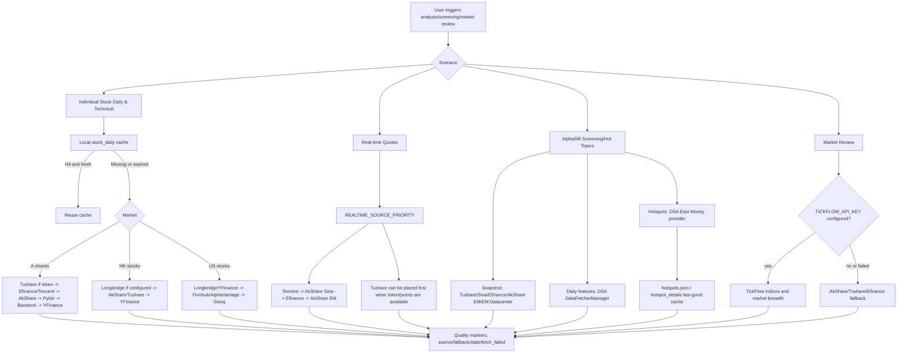
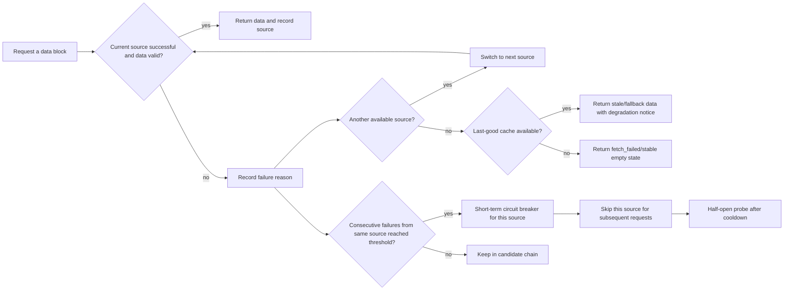
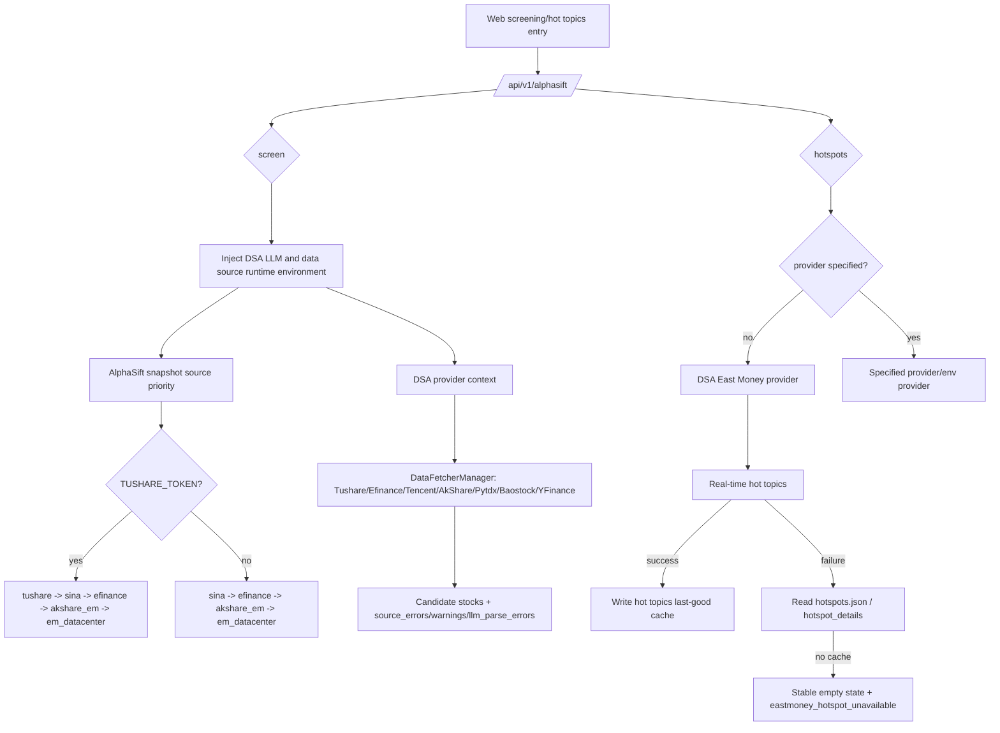

# Data Source Stability and Failure Handling Diagrams

This document is for users, deployers, and maintainers, explaining how DSA's integrated data sources participate in analysis, stock screening, and market review, and how the system degrades when data sources fail.

Core principle: First use data sources already integrated and verified by the project, clearly explaining failure paths; new external data sources should be added in a later phase to avoid expanding the maintenance surface upfront.

## Quick Answer for Users

If you encounter "data source failure," it's usually not that the system can only use one source, but that the free source is rate-limited, the upstream API changed temporarily, network jitter occurred, or the current market/ticker is not supported. DSA has built-in multi-source fallback and will automatically try the next source based on the scenario; if you want more stability, it's recommended to configure at least one token-based stable source:

- A-shares individual stocks and AlphaSift: Prioritize configuring `TUSHARE_TOKEN`, and keep AkShare / Efinance / Tencent / Baostock / YFinance as fallback.
- A-shares market review: After configuring `TICKFLOW_API_KEY`, index and market breadth will prioritize TickFlow, falling back to existing free sources on failure.
- HK stocks / US stocks: After configuring `LONGBRIDGE_*`, prioritize using Longbridge, with YFinance, Finnhub, AlphaVantage continuing as fallback.
- Hot topics: AlphaSift hotspots default to the DSA East Money provider and use local last-good cache to reduce real-time API failure impact.

## Integrated Data Source Matrix

| Scenario | Integrated Sources | Default Usage | Failure Handling |
| --- | --- | --- | --- |
| A-shares Daily/Technical | Efinance, Tencent, AkShare, Tushare, Pytdx, Baostock, YFinance | `DataFetcherManager` tries in priority order; Tushare automatically enters candidates when `TUSHARE_TOKEN` is configured | Tries next source after single source failure; consecutive failures trigger short-term circuit breaker |
| A-shares Real-time Quotes | Tencent, AkShare Sina, Efinance, AkShare EM, Tushare | `REALTIME_SOURCE_PRIORITY` controls order, defaulting to lightweight sources like Tencent/Sina | Failed source records `fallback_from`, successful source continues returning |
| A-shares Market Review | TickFlow, AkShare, Tushare, Efinance | After configuring `TICKFLOW_API_KEY`, primary index and market breadth prioritize TickFlow | Falls back to AkShare/Tushare/Efinance chain when TickFlow has insufficient permissions or fails |
| AlphaSift Screening Snapshots | Tushare, Sina, Efinance, AkShare EM, East Money Datacenter | When `TUSHARE_TOKEN` exists, automatically puts `tushare` in snapshot priority; otherwise uses free source chain | AlphaSift maintains source health; DSA status endpoint surfaces snapshot/daily health |
| AlphaSift Daily Feature Supplement | DSA `DataFetcherManager` | AlphaSift calls DSA provider context, prioritizing DSA daily line and cache chain | Falls back to AlphaSift original daily source only when DSA chain has no data |
| AlphaSift Hot Topics | DSA East Money provider, AlphaSift hotspot, last-good cache | Defaults to DSA East Money provider when no provider specified | Falls back to hotspot cache on real-time failure; returns stable empty state with readable error when no cache |
| HK stocks / US stocks | Longbridge, YFinance, AkShare, Tushare, Finnhub, AlphaVantage, Stooq | After configuring Longbridge credentials, participates in HK/US daily/real-time fallback; YFinance maintains basic fallback | Falls back to YFinance/other available sources when Longbridge is cooling or fails |

## Overall Pipeline Diagram



## Failure and Degradation Diagram



The current daily line source circuit breaker strategy is short-term cooldown of approximately 5 minutes after 3 consecutive failures. Its purpose is not to permanently disable a data source, but to prevent a temporarily unavailable source from slowing down an entire batch of analysis.

## AlphaSift Screening and Hot Topics Pipeline



## Recommended Configuration Profiles

### Free Mode

Suitable for personal trial, relying on free source auto-fallback. Advantage: no token needed; disadvantage: more likely to encounter upstream rate limiting or temporary API changes.

```env
REALTIME_SOURCE_PRIORITY=tencent,akshare_sina,efinance,akshare_em
ENABLE_EASTMONEY_PATCH=true
```

### A-Shares Stable Mode

Suitable for frequent screening, batch analysis, or external services. Tushare enhances A-shares daily line and snapshot stability; TickFlow enhances A-shares daily K, real-time quotes, and market review (real-time quotes need explicit addition to `REALTIME_SOURCE_PRIORITY`); free sources continue as fallback.

```env
TUSHARE_TOKEN=your_tushare_token
TICKFLOW_API_KEY=your_tickflow_key

REALTIME_SOURCE_PRIORITY=tickflow,tushare,tencent,akshare_sina,efinance,akshare_em
SNAPSHOT_SOURCE_PRIORITY=tushare,sina,efinance,akshare_em,em_datacenter

# AlphaSift screening runtime defaults; preserved when explicitly configured
DAILY_FETCH_RETRIES=3
DAILY_FETCH_MAX_WORKERS=1
```

Note: TickFlow capabilities are tiered by plan permissions; insufficient permissions or failed requests will fail-open to existing free sources. It's not recommended as the sole source for all market data.

### HK Stocks / US Stocks Stable Mode

Suitable for HK/US stock portfolios, holdings, and individual stock analysis. After Longbridge configuration, it participates in HK/US chains; YFinance, Finnhub, AlphaVantage serve as fallback.

```env
LONGBRIDGE_OAUTH_CLIENT_ID=your_client_id
LONGBRIDGE_OAUTH_TOKEN_CACHE_B64=your_token_cache_base64

FINNHUB_API_KEY=your_finnhub_key
ALPHAVANTAGE_API_KEY=your_alphavantage_key
```

If still using Legacy Longbridge credentials, you can continue configuring:

```env
LONGBRIDGE_APP_KEY=your_app_key
LONGBRIDGE_APP_SECRET=your_app_secret
LONGBRIDGE_ACCESS_TOKEN=your_access_token
```

## User-Facing Message Recommendations

For external communication, it's recommended to distinguish three scenarios:

| Scenario | Recommended Message |
| --- | --- |
| Single source failed but fallback succeeded | This analysis used a degraded data source; analysis can continue. The report will mark the actual successful source. |
| Multiple sources failed but cache available | Real-time source unavailable; this analysis used the last successful cache. Conclusions will have reduced confidence. |
| All sources failed and no cache | Current data unavailable; please try again later, or configure token-based data sources like Tushare / TickFlow / Longbridge. |

## Potential Product Enhancements

1. Data Source Doctor Page: Display each source's last success time, failure reason, circuit breaker status, and next recovery probe time.
2. One-click Recommended Configuration: Generate `.env` snippets based on market selection, e.g., "A-Shares Stable Mode", "HK/US Stocks Stable Mode", "Free Mode."
3. AlphaSift Status Panel: Directly display snapshot/daily source health so users know whether Sina, Efinance, AkShare, or Tushare is having issues.
4. Batch Task Rate Limiting Strategy: Automatically reduce concurrency for free sources, prioritize reusing local daily line cache, and reduce upstream rate limit triggers.
5. Optional Commercial Source Integration: Only consider adding Twelve Data, Massive/Polygon, Nasdaq Data Link, etc., when existing Tushare / TickFlow / Longbridge / Finnhub / AlphaVantage still cannot cover requirements.

## Official Resources

- Tushare: https://tushare.pro/document/2
- TickFlow: https://tickflow.org/
- AkShare: https://akshare.akfamily.xyz/
- Longbridge OpenAPI: https://open.longportapp.com/
- Finnhub API: https://finnhub.io/docs/api
- Alpha Vantage API: https://www.alphavantage.co/documentation/
